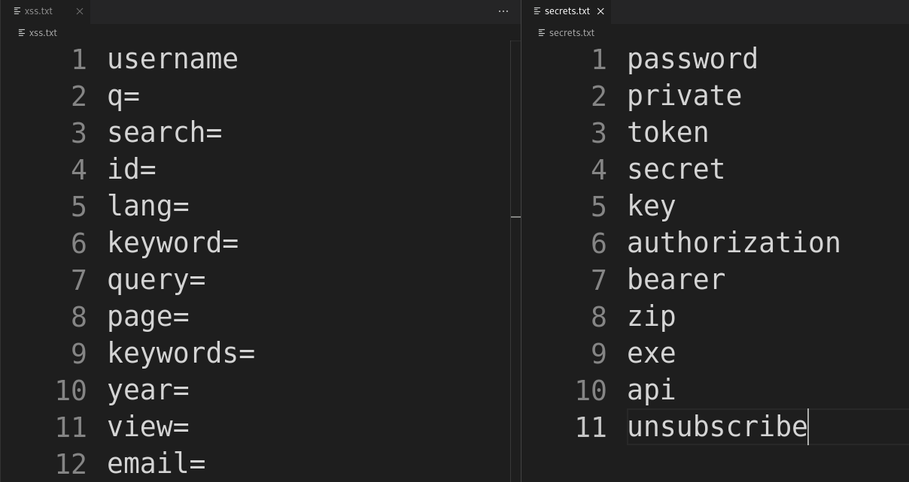

# Pattern-Matching



## Options

```
pm -h
usage: pm [-h] [-u URL_FILE] -p PATTERN [-o OUTPUT] [-r REPLACE] [-v]

Match patterns from a file in URLs, append text at each match, and print/save modified results.

options:
  -h, --help            show this help message and exit
  -u URL_FILE, --url-file URL_FILE
                        File containing URLs (optional, stdin is used if not provided)
  -p PATTERN, --pattern PATTERN
                        Pattern file to use (e.g., xss.txt)
  -o OUTPUT, --output OUTPUT
                        File to save output results (optional)
  -r REPLACE, --replace REPLACE
                        Text to append after each matched pattern (default: FUZZ)
  -v, --version         show program's version number and exit

Examples:
  pm -u urls.txt -p patterns.txt
  pm -u urls.txt -p patterns.txt -o results.txt
  pm -u urls.txt -p patterns.txt -r CUSTOM_TEXT
```

## Usage
```
pm -u params.txt -p /opt/Pattern-Matching/patterns/xss.txt -r "XSS" -o xss_params_output.txt
```

## Piping
```
cat urls.txt | pm -p /opt/Pattern-Matching/patterns/sqli.txt -r "SQLI"
```

## installation

```
cd /opt/
sudo git clone https://github.com/bhunterex/Pattern-Matching.git
cd
sudo chmod +x /opt/Pattern-Matching/pm.py
sudo ln -sf /opt/Pattern-Matching/pm.py /usr/local/bin/pm
pm -h
```
